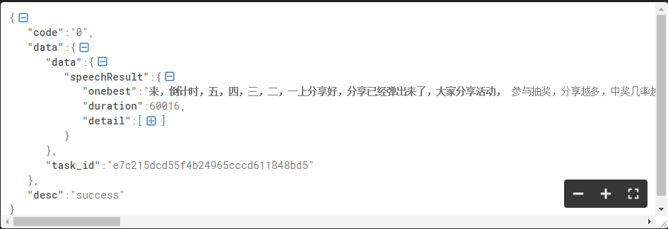

# 长语音离线转写API文档

## 接口说明

长语音转写识别基于深度全序列卷积神经网络框架，通过 http[s] 协议，为超过1分钟的音频而设计。内置标点，说话人分离，语气词过滤等功能，返回对应的文字流内容。

API接口兼容科大讯飞的长语音接口，返回JSON数据兼容科大讯飞的返回内容。

## 音频格式支持

支持的音频格式有： WAV/MP3/WMA/FLAC/AMR/OPUS/M4A/AAC

支持的音频采样率：有"8000", "16000", "44100", "48000"这四种选择

长语音转写产品提供长达**5小时**的语音识别服务，支持中文普通话，并且兼容多种口音。

### 支持音频详情

音频时长：不超过5小时

音频大小：不超过600 MB

音频声道：单声道、双声道

采样率：支持8000、16000、44100和48000 Hz

采样精度：16 bits、8 bits

编码格式：文件格式和音频解码需结合查看，如下表第一行：只支持pcm封装或wav封装的pcm音频，不支持其他文件格式封装的pcm音频。 不同的音频解码格式需在请求体中填写不同的aue.

| 文件格式  | 音频解码 | aue   |
| :-------- | :------- | :---- |
| .wav      | pcm      | pcm   |
| .m4a .aac | aac      | aac   |
| .mp3      | mpeg2    | mpeg2 |
| .opus     | opus     | opus  |
| .flac     | flac     | flac  |

注意
a. opus编码的音频不支持44100 Hz的采样率
b. 仅 wav封装的pcm格式音频支持 8 bits采样精度

## 接口Demo

目前仅提供部分开发语言的demo，其他语言请参照下方接口文档进行开发。

## 接口要求

集成实时语音转写API时，需按照以下要求。

| 内容     | 说明                                                         |
| :------- | ------------------------------------------------------------ |
| 请求协议 | http[s] (为提高安全性，强烈推荐https)                        |
| 请求地址 | http[s]: //ai.abcpen.com/v1/asr/long?{请求参数} *注：服务器IP不固定，为保证您的接口稳定，请勿通过指定IP的方式调用接口，使用域名方式调用* |
| 接口鉴权 | 签名机制，详见 [signa生成](#signa生成)                       |
| 响应格式 | 统一采用JSON格式                                             |
| 开发语言 | 任意，只要可以向笔声云服务发起HTTP请求的均可                 |
| 语言种类 | 中文普通话、中英混合识别、英文                               |


## 接口调用流程

*注：* 若需配置IP白名单，请发送邮件到support@abcpen.com

参数说明

| 参数             | 类型    | 必须 | 说明                                                         | 示例                                                         |
| :--------------- | :------ | :--- | :----------------------------------------------------------- | :----------------------------------------------------------- |
| appid            | string  | 是   | 笔声开放平台应用ID                                           | 595f23df                                                     |
| ts               | string  | 是   | 当前时间戳，从1970年1月1日0点0分0秒开始到现在的秒数          | 1512041814                                                   |
| signa            | string  | 是   | 加密数字签名（基于HMACSHA1算法）                             | IrrzsJeOFk1NGfJHW6SkHUoN9CU=                                 |
| lang             | string  | 否   | 实时语音转写语种，不传默认为中文                             | 语种类型：中文、中英混合识别：cn；英文：en。传参示例如："lang=en" 若未授权无法使用会报错10110 |
| punc             | string  | 否   | 标点过滤控制，默认返回标点，punc=0会过滤结果中的标点         | 0                                                            |
| pd               | string  | 否   | 垂直领域个性化参数: 法院: court 教育: edu 金融: finance 医疗: medical 科技: tech 运营商: isp 政府: gov 电商: ecom 军事: mil 企业: com 生活: life 汽车: car | 设置示例：pd="edu" 参数pd为非必须设置，不设置参数默认为通用  |
| audio_samplerate | string  | 否   | 音频采样率，有"8000", "16000", "44100", "48000"这四种选择，模式是“16000” | “160000”                                                     |
| audio_encode     | string  | 否   | 音频编码格式，有"pcm", "aac", "mpeg2", "opus", "flac"这五种选择，请选择其中一种编码格式， 默认“mpeg2” | “mpeg2”, 常规的mp3编码；详细的音频编码格式，参考上述[支持音频详情](#支持音频详情) |
| speaker_number   | Integer | 否   | 发音人个数，可选值：0-10，0表示盲分。2-4时，表示指定了说话人的数量，返回speakerIds。<br/>*注*：发音人分离目前还是测试效果达不到商用标准，如测试无法满足您的需求，请慎用该功能。 | 默认：2（适用通话时两个人对话的场景）；0表示由AI引擎自我推理计算 |
| has_participle   | string  | 否   | 逐字输出开关。 默认false，逐句输出。 true，开启后带有逐字模式。 | 默认为false。                                                |

#### signa生成

1.获取baseString，baseString由appid和当前时间戳ts拼接而成，假如appid为595f23df，ts为1512041814，则baseString为

> 595f23df1512041814

2.对baseString进行MD5，假如baseString为上一步生成的595f23df1512041814，MD5之后则为

> 0829d4012497c14a30e7e72aeebe565e

3.以apiKey为key对MD5之后的baseString进行HmacSHA1加密，然后再对加密后的字符串进行base64编码。
假如apiKey为d9f4aa7ea6d94faca62cd88a28fd5234，MD5之后的baseString为上一步生成的0829d4012497c14a30e7e72aeebe565e，
则加密之后再进行base64编码得到的signa为

> IrrzsJeOFk1NGfJHW6SkHUoN9CU=

备注：

- apiKey：接口密钥，在应用中添加实时语音转写服务时自动生成，调用方注意保管；
- signa的生成公式：HmacSHA1(MD5(appid + ts), api_key)，具体的生成方法参考本git实例代码；

####请求示例

```text
	ws://ai.abcpen.com/v1/asr/ws?appid=595f23df&ts=1512041814&signa=IrrzsJeOFk1NGfJHW6SkHUoN9CU=&pd=edu
```

#### 返回值

结果格式为json，字段说明如下：

| 参数 | 类型   | 说明                            |
| :--- | :----- | :------------------------------ |
| code | string | 结果码(具体见[错误码](#错误码)) |
| data | string | 结果数据                        |
| desc | string | 描述                            |

其中sid字段主要用于DEBUG追查问题，如果出现问题，可以提供sid帮助确认问题。

> 成功

```json
 {'code': '0', 'data': {'data': {'speechResult': {'onebest': '来，倒计时，五，四，三，二，一上分享好，分享已经弹出来了，大家分享活动， 参与抽奖，分享越多，中奖几率越大，前提是关注直播间是的，一定要关注，不然你中奖了，客服联系不到大家，大家如果中奖以后看一下自己的私信，说不定会收到我们客服的提示，记录地址给大家发货，连邮费都不需要出。嗯，谢谢 大家，谢谢大家。继续，我要剧透一下今天在直播间会有什么很重要的一件事情。今天是我们的复兴有礼，给大家准备了很多很好看的戒指和视频，包括像我身上的这一套都会有我的耳环，然后我的项链还有我的戒指都会在有一会儿多姐 大概七八点钟左右给大家看，差不多这个时间，突然pp今天显得富贵了起来，富贵人间富贵花啊。我也不能认输啊。怎么怎么来这个表手表昨天很多人在问浩浩的手表什么时候会有，今天在直播间我们大约会在八点钟给大家开海鸥官方旗 舰店的机械手表，不仅自己带，你送爸爸也可以。', 'duration': 60016, 'detail': [{'sentences': '来，', 'wordBg': '40', 'wordEd': '720', 'speakerId': '0'}, {'xxx'}, {'xxx'}]}},'task_id': 'e7c215dcd55f4b24965cccd611848bd5'}, 'desc': 'success'}
```
返回Json图片实例


>
> 失败

```json
 {'code': '10701', 'data': {}, 'desc': 'Audio encode error, only support pcm, aac, mpeg2, opus and flac'}
```


### 结果示例：

```json
{'code': '0', 'data': {'data': {'speechResult': {'onebest': '来，倒计时，五，四，三，二，一上分享好，分享已经弹出来了，大家分享活动， 参与抽奖，分享越多，中奖几率越大，前提是关注直播间是的，一定要关注，不然你中奖了，客服联系不到大家，大家如果中奖以后看一下自己的私信，说不定会收到我们客服的提示，记录地址给大家发货，连邮费都不需要出。嗯，谢谢 大家，谢谢大家。继续，我要剧透一下今天在直播间会有什么很重要的一件事情。今天是我们的复兴有礼，给大家准备了很多很好看的戒指和视频，包括像我身上的这一套都会有我的耳环，然后我的项链还有我的戒指都会在有一会儿多姐 大概七八点钟左右给大家看，差不多这个时间，突然pp今天显得富贵了起来，富贵人间富贵花啊。我也不能认输啊。怎么怎么来这个表手表昨天很多人在问浩浩的手表什么时候会有，今天在直播间我们大约会在八点钟给大家开海鸥官方旗 舰店的机械手表，不仅自己带，你送爸爸也可以。', 'duration': 60016, 'detail': [{'sentences': '来，', 'wordBg': '40', 'wordEd': '720', 'speakerId': '0'}, {'sentences': '倒计时，', 'wordBg': '720', 'wordEd': '1320', 'speakerId': '0'}, {'sentences': '五，', 'wordBg': '1320', 'wordEd': '2120', 'speakerId': '1'}, {'sentences': '四，', 'wordBg': '2120', 'wordEd': '2640', 'speakerId': '1'}, {'sentences': '三，', 'wordBg': '2640', 'wordEd': '3120', 'speakerId': '1'}, {'sentences': '二，', 'wordBg': '3120', 'wordEd': '3640', 'speakerId': '1'}, {'sentences': '一上分享好，', 'wordBg': '3640', 'wordEd': '5720', 'speakerId': '1'}, {'sentences': '分享已经弹出来了，', 'wordBg': '5720', 'wordEd': '6880', 'speakerId': '1'}, {'sentences': '大家分享活动，', 'wordBg': '6880', 'wordEd': '7800', 'speakerId': '1'}, {'sentences': '参与抽奖，', 'wordBg': '7800', 'wordEd': '8400', 'speakerId': '1'}, {'sentences': '分享越多，', 'wordBg': '8400', 'wordEd': '8960', 'speakerId': '1'}, {'sentences': '中奖几率越大，', 'wordBg': '8960', 'wordEd': '9840', 'speakerId': '1'}, {'sentences': '前提是关注直播间是的，', 'wordBg': '9840', 'wordEd': '11640', 'speakerId': '1'}, {'sentences': '一定要关注，', 'wordBg': '11640', 'wordEd': '12360', 'speakerId': '0'}, {'sentences': ' 不然你中奖了，', 'wordBg': '12360', 'wordEd': '13170', 'speakerId': '0'}, {'sentences': '客服联系不到大家，', 'wordBg': '13170', 'wordEd': '14360', 'speakerId': '0'}, {'sentences': '大家如果中奖以后看一下自己 的私信，', 'wordBg': '14360', 'wordEd': '17000', 'speakerId': '0'}, {'sentences': '说不定会收到我们客服的提示，', 'wordBg': '17000', 'wordEd': '18640', 'speakerId': '0'}, {'sentences': '记录地址给大家发货，', 'wordBg': '18640', 'wordEd': '19800', 'speakerId': '0'}, {'sentences': '连邮费都不需要出。', 'wordBg': '19800', 'wordEd': '20960', 'speakerId': '0'}, {'sentences': '嗯，', 'wordBg': '20960', 'wordEd': '21200', 'speakerId': '1'}, {'sentences': '谢谢大家，', 'wordBg': '21200', 'wordEd': '21800', 'speakerId': '1'}, {'sentences': '谢谢大家。', 'wordBg': '21800', 'wordEd': '22360', 'speakerId': '0'}, {'sentences': '继续，', 'wordBg': '22360', 'wordEd': '22600', 'speakerId': '0'}, {'sentences': '我要剧透一下今天在直播间会有什么很重要的一件事情。', 'wordBg': '22600', 'wordEd': '26080', 'speakerId': '0'}, {'sentences': '今天是 我们的复兴有礼，', 'wordBg': '26080', 'wordEd': '28520', 'speakerId': '0'}, {'sentences': '给大家准备了很多很好看的戒指和视频，', 'wordBg': '28520', 'wordEd': '32280', 'speakerId': '0'}, {'sentences': '包括像 我身上的这一套都会有我的耳环，', 'wordBg': '32280', 'wordEd': '36220', 'speakerId': '1'}, {'sentences': '然后我的项链还有我的戒指都会在有一会儿多姐大概七八点钟左右给大家看，', 'wordBg': '36220', 'wordEd': '41940', 'speakerId': '1'}, {'sentences': '差不多这个时间，', 'wordBg': '41940', 'wordEd': '42780', 'speakerId': '0'}, {'sentences': '突然 pp 今天显得富贵了起来，', 'wordBg': '42780', 'wordEd': '44820', 'speakerId': '0'}, {'sentences': '富贵人间富贵花啊。', 'wordBg': '44820', 'wordEd': '46140', 'speakerId': '1'}, {'sentences': '我也不能认输啊。', 'wordBg': '46140', 'wordEd': '47340', 'speakerId': '0'}, {'sentences': ' 怎么怎么来这个表手表昨天很多人在问浩浩的手表什么时候会有，', 'wordBg': '47340', 'wordEd': '52500', 'speakerId': '0'}, {'sentences': '今天在直播间我们大约会在八点钟给大家开海鸥官方旗舰店的机械手表，', 'wordBg': '52500', 'wordEd': '57980', 'speakerId': '0'}, {'sentences': '不仅自己带，', 'wordBg': '57980', 'wordEd': '58620', 'speakerId': '1'}, {'sentences': '你送爸爸也可以。', 'wordBg': '58620', 'wordEd': '59800', 'speakerId': '1'}]}}, 'task_id': 'e7c215dcd55f4b24965cccd611848bd5'}, 'desc': 'success'}
```

转写结果data字段说明如下：

| 字段     | 类型                 | 含义                               |
| :------- | -------------------- | :--------------------------------- |
| onebest  | String               | 转写的结果文本全部输出。           |
| duration | Int                  | 音频文件的时长。单位ms             |
| detail   | JSON Object（array） | 转写输出的句或者字的详细数据信息。 |

detail结构体

| 参数名     | 类型                 | 是否必须 | 描述                                                         |
| :--------- | :------------------- | :------- | :----------------------------------------------------------- |
| sentences  | string               | 否       | 每句的转写结果。                                             |
| wordBg     | string               | 否       | 每句的开始时间。音频起始点为0。单位ms 如果关闭时间戳定位功能，不返回。 |
| wordEd     | string               | 否       | 每字或每句结束时间。如果关闭时间戳定位功能，不返回。         |
| speakerId  | string               | 否       | 每句的说话人Id。                                             |
| wordsPiece | JSON Object（array） | 否       | 句中所对应的每字信息。开启byWords时，返回wordsPiece部分。    |


#### 接收错误信息

交互过程中，在服务端出现异常而中断服务时（如会话超时），会将异常信息以 text message 形式返回给客户端并关闭连接。

## 白名单

在调用该业务接口时

- 若关闭IP白名单，接口认为IP不限，不会校验IP。
- 若打开IP白名单，则服务端会检查调用方IP是否在笔声开放平台配置的IP白名单中，对于没有配置到白名单中的IP发来的请求，服务端会拒绝服务。

IP白名单规则

- IP白名单，在 控制台-我的应用-相应服务的应用管理卡片上 编辑，保存后五分钟左右生效；
- 不同Appid的不同服务都需要分别设置IP白名单；
- IP白名单需设置为外网IP，请勿设置局域网IP。
- 如果服务器返回结果如下所示(illegal client_ip)，则表示由于未配置IP白名单或配置有误，服务端拒绝服务。

```json
{
	"action": "error",
	"code": "10105",
	"data": "",
	"desc": "illegal access|illegal client_ip: xx.xx.xx.xx",
	"sid": "rta..."
}
```

## 错误码

| 错误码 | 描述                                                         | 说明                     | 处理方式                                                    |
| :----- | :----------------------------------------------------------- | :----------------------- | :---------------------------------------------------------- |
| 0      | success                                                      | 成功                     |                                                             |
| 10105  | illegal access                                               | 没有权限                 | 检查apiKey，ip，ts等授权参数是否正确                        |
| 10106  | invalid parameter                                            | 无效参数                 | 上传必要的参数， 检查参数格式以及编码                       |
| 10107  | illegal parameter                                            | 非法参数值               | 检查参数值是否超过范围或不符合要求                          |
| 10109  | audio url is not valid http(s) url                           | audio_url不是http[s]链接 | 长语音识别的时候，audio_url必须是http[s]链接                |
| 10110  | no license                                                   | 无授权许可               | 检查参数值是否超过范围或不符合要求                          |
| 10700  | engine error                                                 | 引擎错误                 | 提供接口返回值，向服务提供商反馈                            |
| 10701  | Audio encode error, only support pcm, aac, mpeg2, opus and flac | 音频编码错误             | 支持pcm, aac, mpeg2, opus 和 flac这几种编码，请选择其中一种 |
| 10702  | Audio sample error, only support 8000、16000、44100 and 48000 Hz | 音频采样率错误           | 支持 8000、16000、44100 和 48000 Hz，请选择其中一种         |
| 10202  | websocket connect error                                      | websocket连接错误        | 检查网络是否正常                                            |
| 10204  | websocket write error                                        | 服务端websocket写错误    | 检查网络是否正常，向服务提供商反馈                          |
| 10205  | websocket read error                                         | 服务端websocket读错误    | 检查网络是否正常，向服务提供商反馈                          |
| 16003  | basic component error                                        | 基础组件异常             | 重试或向服务提供商反馈                                      |
| 10800  | over max connect limit                                       | 超过授权的连接数         | 确认连接数是否超过授权的连接数                              |

## 常见问题

#### 实时语音转写支持什么平台？

> 答：实时转写只支持webapi接口，开放平台“实时语音转写”需要WebSocket接入，针对是有编程基础的开发者用户。如果您是个人用户，不想通过编程方式直接实现语音转写功能，可以去笔声听见官网，了解语音转写功能的更多详情。

#### 实时语音转写支持什么语言？

> 答：中文普通话、中英混合识别、英文，小语种以及中文方言可以到控制台-实时语音转写-方言/语种处添加试用或购买。

#### 支持的音频是什么格式？

> 答：采样率为16K，采样深度为16bit的pcm_s16le音频

####实时语音转写支持的音频时长有什么限制？

> 答：实时语音转写可以实时识别持续的音频流，结果是实时返回，音频流长度理论上不做限制，典型的应用场景是大会或者直播的实时字幕。

#### 实时语音转写的分片时长200ms是什么意思？

> 答：可以理解为上传的间隔为200ms，建议音频流每200ms向服务器发送6400字节，发过快可能导致引擎出错，音频发送间隔超时时间为15s，超时服务端报错并主动断开连接。

#### 如何购买实时语音转写？

> 答：登录笔声开放平台，进入实时语音转写页面，点击“申请购买”按钮，在线购买时长与路数即可。

#### 实时语音转写如何添加IP白名单？

> 答：登录笔声开放平台，点击右上角的“控制台”，点击“我的应用”，选择到所创建的实时语音转写Web api应用平台，点击IP白名单“管理”按钮，即可添加IP白名单。

#### 实时语音转写如何免费试用？

> 答：可在实时语音转写服务的产品页面，直接领取免费使用权限；到期后可直接在控制台点击购买时长和授权（价格可见）

#### 实时语音转写和语音听写的区别有哪些？

> 答：支持时长：在线语音听写单次会话支持60s以内的语音转文字；实时语音转写的音频流长度理论上不做限制
> 支持语种：在线语音听写除中文普通话和英文外，支持12个语种，25种方言；实时语音转写支持中文普通话、中英混合识别、英语、开通的小语种以及中文方言；
> 应用场景：在线语音听写主要用于短语音的识别，如聊天输入、语音搜索等；实时语音转写可以实时识别持续的音频流，典型的应用场景是大会或者直播的实时字幕

#### 实时语音转写接口返回10105，如何解决？

> 答：未通过服务端校验，请检查appid，apiKey，ip白名单，checkSum等授权参数是否正确。

#### 调用实时语音转写接口报10110错误码，如何解决？

> 答：没有授权许可或授权数已满，请至控制台查看时长和路数情况，并查看有效期；如果未领取免费包，请至产品页面领取。

#### 实时语音转写支不支持离线？

> 答：这个问题有点矛盾；我们有离线识别的api，请使用离线asr api完成请求服务。

#### 实时语音转写如果一次连接使用时长超出了剩余时长怎么办？

> 答：首先为了使业务使用不受影响，如果在连接期间使用时长超出，转写功能并不会立刻停止。本次连接断开后时长可能会出现为负数的情况，请在使用过程中关注时长剩余情况并及时购买时长。